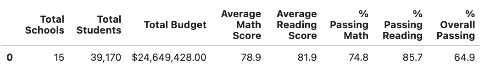
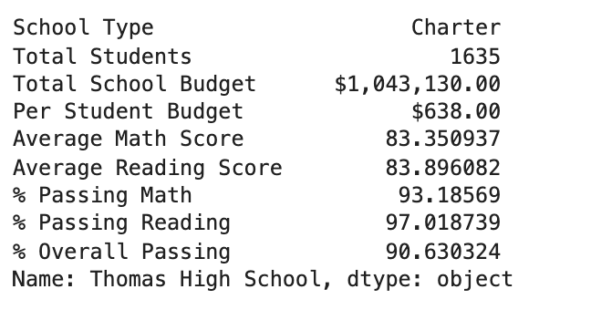
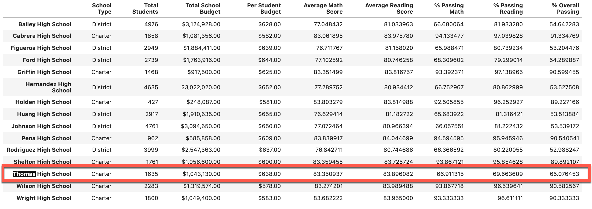
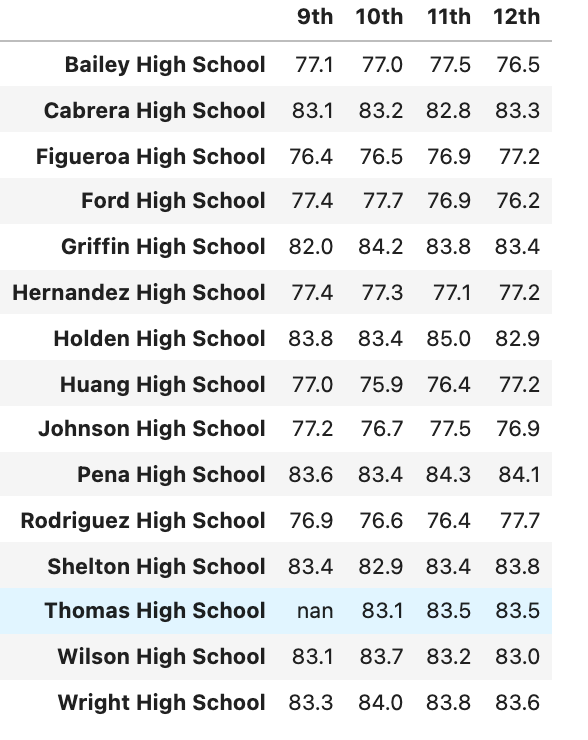

# School_District_Analysis

## Overview of the school district analysis

### Purpose 
The purpose of this analysis is to understand if there was any evidence of academic dishonesty specifically for Thomas High School ninth grade math and reading grades. The school board does not know the full extent of the academic dishonesty, and in order to uphold the state testing standard, they have hired a firm to investigate this.

## Results

### District Summary

### School Summary

- percentage passing math dropped from 93.2% to 66.9%
- percentage passing reading dropped from 97.3% to 69.7%
- overall passing percentage dropped from 90.9% to 65.1%

### Performance of Thomas High School
Thomas High School was no longer included on the list of top five schools.

### Math and reading score by grade
Ninth grade math and reading scores were replaced with NaN.

- Math score:

- Reading 

### Scores by school spending

Schools that spends $551 - $600 appears to have the best overall performance

### Scores by school size

Looking at the school sizes, "Large" Schools (Over 2,000 Students) have the lowest average scores and passing percentages. 

### Scores by school type

Charter schools performed better than district schools.

## Summary

### Changes in the updated school district analysis. 
The entire ninth grade class of Thomas High School  had their scores replaced with NaN. By doing so the following were affected 

- Thomas High School lost its placement as a top five school within this District. 

- With the scores removed for only ninth grade in Thomas High School (THS), THS had no data to report for ninth grade math and reading

- THS passing scores for both Math and reading dropped.

- The district's overall math and reading average decreased.